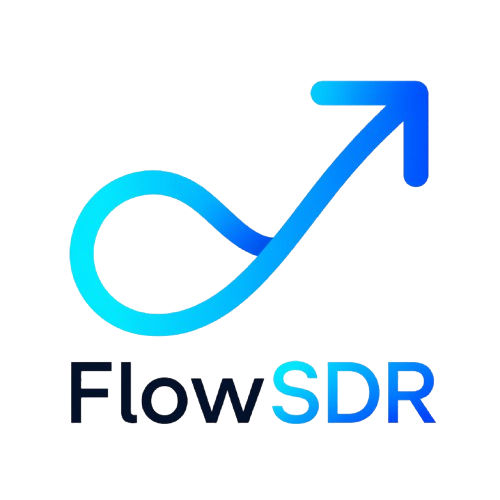

  
  <h1>🚀 FlowSDR — CRM Inteligente para SDRs</h1>
  
<i>Escalando a personalização de vendas com Inteligência Artificial.</i>

---

## 📺 Apresentação em Vídeo
Assista à demonstração completa das funcionalidades e da arquitetura técnica:
[**CLIQUE AQUI PARA VER O VÍDEO NO YOUTUBE**](LINK_DO_TEU_VIDEO_AQUI)

---

## 💡 A Ideia
O **FlowSDR** foi construído para resolver a dor real de quem está na linha de frente da prospecção. O objetivo é permitir que o SDR foque na estratégia, enquanto a IA cuida da redação personalizada, utilizando contextos reais de campanhas.

## 🔗 Links do Projeto
* **Deploy Oficial:** [Link da Vercel](LINK_DO_TEU_DEPLOY_AQUI)
* **Stack:** React, Tailwind CSS, Supabase, Gemini 2.5 Flash.

## 🛠️ Destaques Técnicos
* **Multi-Tenancy:** Isolamento total de dados por Workspace via Supabase RLS.
* **Kanban Inteligente:** Fluxo de leads com validações de dados para garantir prompts de alta qualidade.
* **IA Edge Functions:** Processamento de mensagens em tempo real com baixa latência.

---
Desenvolvido por **Mauricio** — Engenheiro de Software.
